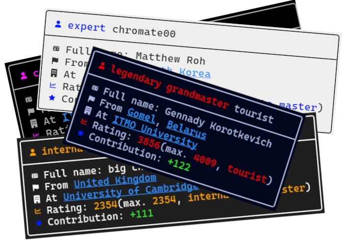

# Codefetch



Codefetch is a decorative program that displays [codeforces](https://codeforces.com) profiles on a terminal.

## Installation
### Dependencies:
 - A [C++](https://isocpp.org/) compiler
 - [Make](https://www.gnu.org/software/make/manual/make.html) (optional)
 - [libcurl](https://curl.se/libcurl/)

To install, execute these:
```bash
git clone https://github.com/cMerd/codefetch.git
mkdir build
make
sudo cp ./build/codefetch /usr/bin/codefetch
```

## Usage
```bash
$ codefetch <handle>
╭────────────────────────────────────╮
│  Rank Handle                      │
├────────────────────────────────────┤
│  Full name: Name                  │
│  From City, Country               │
│  At Organization                  │
│  Rating: ____(max. ____, Rank)    │
│  Contribution: +___               │
╰────────────────────────────────────╯
```

### Note
Colors don't work on windows.